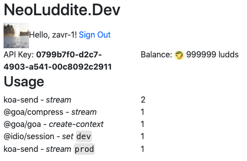

# @idio/idio

[](https://www.npmjs.com/package/@idio/idio)

<a href="https://github.com/idiocc/idio"></a>

`@idio/idio` contains Koa's fork called Goa &mdash; web server compiled with _Closure Compiler_ so that its source code is optimised and contains only 1 external dependency (`mime-db`). Idio adds essential middleware to Goa for session, static files, CORS and compression and includes the router. As the project grows, more middleware will be added and optimised.

This is a production-ready server that puts all components together for the ease of use, while providing great developer experience using JSDoc annotations for auto-completions. _Idio_ is not a framework, but a library that enables **idiomatic** usage and compilation of the server and middleware.

<p align="center">
  <a href="https://www.idio.cc"></a>
</p>


```sh
yarn add @idio/idio
npm install @idio/idio
```

## Table Of Contents

- [Table Of Contents](#table-of-contents)
- [API](#api)
- [`async idio(middlewareConfig=, config=): !Idio`](#async-idiomiddlewareconfig-middlewareconfigconfig-config-idio)
  * [`MiddlewareConfig`](#type-middlewareconfig)
  * [`Config`](#type-config)
  * [`Idio`](#type-idio)
  * [<code>ConfiguredMiddleware</code>](#type-configuredmiddleware)
- [Middleware](#middleware)
  * [Static](#static)
  * [Session](#session)
  * [CORS](#cors)
  * [Compression](#compression)
  * [File Upload](#file-upload)
  * [Front End](#front-end)
- [Custom Middleware](#custom-middleware)
- [Router Set-up](#router-set-up)
- [NeoLuddite.Dev](#neoludditedev)
  * [`NeoLudditeOptions`](#type-neoludditeoptions)
- [Copyright & License](#copyright--license)

<p align="center"><a href="#table-of-contents">
  
</a></p>


## API

The package is available by importing its default function and named components:

```js
import idio, { Keygrip, Router } from '@idio/idio'
```

<p align="center"><a href="#table-of-contents">
  
</a></p>

## <code>async <ins>idio</ins>(</code><sub><br/>&nbsp;&nbsp;`middlewareConfig=: !MiddlewareConfig,`<br/>&nbsp;&nbsp;`config=: !Config,`<br/></sub><code>): <i>!Idio</i></code>
Start the server. Sets the `proxy` property to `true` when the NODE_ENV is equal to _production_.

 - <kbd>middlewareConfig</kbd> <em><code><a href="#type-middlewareconfig" title="Middleware configuration for the `idio` server.">!MiddlewareConfig</a></code></em> (optional): The middleware configuration for the `idio` server.
 - <kbd>config</kbd> <em><code><a href="#type-config" title="Server configuration object.">!Config</a></code></em> (optional): The server configuration object.

The app can be stopped with an async `.destroy` method implemented on it that closes all connections.


There are multiple items for middleware configuration:

__<a name="type-middlewareconfig">`MiddlewareConfig`</a> extends FnMiddlewareConfig__: Middleware configuration for the `idio` server.


|    Name    |                                                                                                                                                                    Type                                                                                                                                                                     |                                        Description                                        |
| ---------- | ------------------------------------------------------------------------------------------------------------------------------------------------------------------------------------------------------------------------------------------------------------------------------------------------------------------------------------------- | ----------------------------------------------------------------------------------------- |
| static     | <em>(<a href="https://github.com/idiocc/idio/wiki/Static#type-staticoptions" title="Top-level options when setting up static middleware.">!StaticOptions</a> \| !Array&lt;<a href="https://github.com/idiocc/idio/wiki/Static#type-staticoptions" title="Top-level options when setting up static middleware.">!StaticOptions</a>&gt;)</em> | _Static_ middleware options.                                                              |
| compress   | <em>[!CompressOptions](https://github.com/idiocc/idio/wiki/Compression#type-compressoptions)</em>                                                                                                                                                                                                                                           | _Compression_ middleware options.                                                         |
| session    | <em><a href="https://github.com/idiocc/idio/wiki/Session#type-sessionoptions" title="Options for the session that extend the session config.">!SessionOptions</a></em>                                                                                                                                                                      | _Session_ middleware options.                                                             |
| cors       | <em>[!CorsOptions](https://github.com/idiocc/idio/wiki/Cors#type-corsoptions)</em>                                                                                                                                                                                                                                                          | _CORS_ middleware options.                                                                |
| form       | <em><a href="https://github.com/idiocc/idio/wiki/Form-Data#type-formdataoptions" title="Options for Form Data (and file uploads) streams handling.">!FormDataOptions</a></em>                                                                                                                                                               | _Form Data_ middleware options for receiving file uploads and form submissions.           |
| frontend   | <em><a href="https://github.com/idiocc/idio/wiki/Front-End#type-frontendoptions" title="Options for the frontend.">!FrontEndOptions</a></em>                                                                                                                                                                                                | _Front End_ middleware allows to serve source code from `node_modules` and transpile JSX. |
| neoluddite | <em><a href="#type-neoludditeoptions" title="Options for the neoluddite.dev client.">!NeoLudditeOptions</a></em>                                                                                                                                                                                                                            | Records the usage of middleware to compensate their developers' intellectual work.        |

The types for starting the server include the address, port and router configuration.

__<a name="type-config">`Config`</a>__: Server configuration object.


|  Name  |                                                                   Type                                                                    |              Description               |  Default  |
| ------ | ----------------------------------------------------------------------------------------------------------------------------------------- | -------------------------------------- | --------- |
| port   | <em>number</em>                                                                                                                           | The port on which to start the server. | `5000`    |
| host   | <em>string</em>                                                                                                                           | The host on which to listen.           | `0.0.0.0` |
| router | <em><a href="https://github.com/idiocc/goa-router/wiki/Home#type-routerconfig" title="Config for the router.">!_goa.RouterConfig</a></em> | The configuration for the router.      | -         |

After the app is started, it can be accessed from the return type.

__<a name="type-idio">`Idio`</a>__: The return type of the idio.


|      Name       |                                                                                                                    Type                                                                                                                    |                                                                                                            Description                                                                                                             |
| --------------- | ------------------------------------------------------------------------------------------------------------------------------------------------------------------------------------------------------------------------------------------ | ---------------------------------------------------------------------------------------------------------------------------------------------------------------------------------------------------------------------------------- |
| __url*__        | <em>string</em>                                                                                                                                                                                                                            | The URL on which the server was started, such as `http://localhost:5000`.                                                                                                                                                          |
| __server*__     | <em><a href="https://nodejs.org/api/http.html#http_class_http_server" title="An HTTP server that extends net.Server to handle network requests.">!http.Server</a></em> | The server instance.                                                                                                                                                                                                               |
| __app*__        | <em><a href="https://github.com/idiocc/idio/wiki/Home#type-application" title="The application with some additions.">!Application</a></em>                                                                                                 | The Goa application instance (with additional `.destroy` method).                                                                                                                                                                  |
| __middleware*__ | <em><a href="#type-configuredmiddleware" title="Idio-specific properties of the middleware object.">!ConfiguredMiddleware</a></em>                                                                                                         | An object with configured middleware functions, which can be installed manually using `app.use`, or `router.use`. The context will be a standard Goa context with certain properties set by bundled middleware such as `.session`. |
| __router*__     | <em><a href="https://github.com/idiocc/idio/wiki/Router#type-router" title="The router decorated with HTTP method properties.">!Router</a></em>                                                                                            | The router instance.                                                                                                                                                                                                               |

All middleware can be accessed from the `middleware` property, so that it can be installed on individual basis on specific routes, if it's not used app-wise.

<details>
 <summary><strong><a name="type-configuredmiddleware"><code>ConfiguredMiddleware</code></a> extends MiddlewareObject</strong>: Idio-specific properties of the middleware object.</summary>

|  Name   |                                                                                                       Type                                                                                                        |                                Description                                |
| ------- | ----------------------------------------------------------------------------------------------------------------------------------------------------------------------------------------------------------------- | ------------------------------------------------------------------------- |
| form    | <em><a href="https://github.com/idiocc/idio/wiki/Form-Data#type-formdata" title="An instance to create middleware.">!_multipart.FormData</a></em>                                                                 | An instance of the form data class that can be used to create middleware. |
| session | <em><a href="https://github.com/idiocc/idio/wiki/Home#middlewarectx-contextnext-function-promisevoid" title="The function to handle requests which can be installed with the `.use` method.">!Middleware</a></em> | The session middleware to be installed on individual routes.              |
</details>

The example below starts a simple server with session and custom middleware, which is installed (used) automatically because it's defined as a function.

<table>
<tr><th><a href="example/index.js">Source</a></th><th>Output</th>
</tr><tr>
<td>

```js
const { url, app,
  middleware: { session, form },
  router,
} = await idio({
  // Developers' payment scheme neoluddite.dev
  neoluddite: {
    env: process.env.NODE_ENV,
    key: '0799b7f0-d2c7-4903-a541-00c8092c2911',
    app: 'idio.example',
  },
  // Idio's bundled middleware.
  session: {
    algorithm: 'sha512',
    keys: ['hello', 'world'],
    prefix: 'example-',
  },
  static: {
    use: true,
    root: 'upload',
  },
  form: {
    config: {
      dest: 'upload',
    },
  },
  // Any middleware function to be use app-wise.
  async middleware(ctx, next) {
    console.log('//', ctx.method, ctx.path)
    await next()
  },
})
app.use(router.routes())
router.get('/', session, (ctx) => {
  ctx.body = 'hello world'
})
router.post('/upload', session, async (ctx, next) => {
  if (!ctx.session.user) {
    ctx.status = 403
    ctx.body = 'you must sign in to upload'
    return
  }
  await next()
}, form.single('/upload'), (ctx) => {
  // db.create({
  //  user: ctx.session.id,
  //  file: ctx.req.file.path,
  // })
  ctx.body = 'Thanks for the upload. Link: ' +
    `${url}/${ctx.file.filename}`
})
```
</td>
<td>

```
http://localhost:5000
// GET /
hello world
```
</td></tr>
</table>

<p align="center"><a href="#table-of-contents">
  
</a></p>

## Middleware

Idio's advantage is that is has the essential middleware, that was compiled together with the server, so that the packages are reused and memory footprint is low.

<p align="center"><a href="#table-of-contents">
  
</a></p>

### Static

<kbd>🗂 [Explore Static Middleware Configuration](../../wiki/Static)</kbd>

Used to serve static files, such as stylesheets, images, videos, html and everything else. Will perform mime-type lookup to serve the correct content-type in the returned header.

<table>
<tr><th><a href="example/static.js">Static</a> <a href="example/static2.js">source</a></th><th>The Output</th></tr>
<tr><td>

```js
const { url, app } = await idio({
  static: {
    root: 'example', use: true,
  },
```

```js
// or multiple locations
  static: [{
    root: ['example'], use: true,
  }, {
    root: ['wiki'], use: true,
  }],
}, { port: null })
```
</td>
<td>

```css
/** http://localhost:50489/app.css */ 

body {
  font-size: larger;
}
```


<tr>
<td colspan="2">

<details>
<summary>Show Response Headers</summary>

```http
Content-Length: 29
Last-Modified: Thu, 18 Jul 2019 14:34:31 GMT
Cache-Control: max-age=0
Content-Type: text/css; charset=utf-8
Date: Thu, 09 Jan 2020 00:29:42 GMT
Connection: close
```


```http
Content-Length: 114
Last-Modified: Sat, 28 Dec 2019 18:07:31 GMT
Cache-Control: max-age=0
Content-Type: image/svg+xml
Date: Thu, 09 Jan 2020 00:29:42 GMT
Connection: close
```
</details>
</td>
</tr>
</table>

<p align="center"><a href="#table-of-contents">
  
</a></p>

### Session

<kbd>👳‍♂️[Explore Session Middleware Configuration](../../wiki/Session)</kbd>

Allows to store data in the `.session` property of the context. The session is serialised and placed in cookies. When the request contains the cookie, the session will be restored and validated (if signed) against the key.

<table>
<tr><th><a href="example/session.js">Session Config</a></th></tr>
<tr><td>

```js
const { url, app } = await idio({
  session: { use: true, keys:
    ['hello', 'world'], algorithm: 'sha512' },
  async middleware(ctx, next) {
    if (ctx.session.user)
      ctx.body = 'welcome back '
        + ctx.session.user
    else {
      ctx.session.user = 'u'
        + (Math.random() * 1000).toFixed(1)
      ctx.body = 'hello new user'
    }
    await next()
  },
})
```
</td>
</tr>
<tr><td>
The session data is encrypted with <code>base64</code> and signed by default, unless the <code>.signed</code> option is set to false. Signing means that the signature will contain the hash which will be validated server-side, to ensure that the session data was not modified by the client. The default algorithm for signing is <code>sha1</code>, but it can be easily changed to a more secure <code>sha512</code>.
</td>
</tr>
<tr>
<td>

```js
// GET /
"hello new user"
/* set-cookie */
[ { name: 'koa:sess',
    value: 'eyJ1c2VyIjoidTc1MC4zIiwiX2V4cGlyZSI6MTU3ODYxNjE4MzY3MCwiX21heEFnZSI6ODY0MDAwMDB9',
    path: '/',
    expires: 'Fri, 10 Jan 2020 00:29:43 GMT',
    httponly: true },
  { name: 'koa:sess.sig',
    value: 'z-2_tqAz0BsVZbzl7CJRIEKbfU6Sp-SPbt5cas5fAu3v2bQwjaZNCOO5nnL37vZ7jgkymZWNvUHaB8ikgd1agw',
    path: '/',
    expires: 'Fri, 10 Jan 2020 00:29:43 GMT',
    httponly: true } ]
// GET /
"welcome back u750.3"
```
</td>
</tr>
</table>

<p align="center"><a href="#table-of-contents">
  
</a></p>

### CORS

<kbd>👮‍♀️[Explore CORS Middleware Configuration](../../wiki/Cors)</kbd>

To enable dynamic communication between clients and the server via JavaScript requests from the browser, the server must respond with `Access-Control-Allow-Origin` header that sets the appropriate allowed _Origin_. This middleware is easy to use on production and development environments.

<table>
<tr><th><a href="example/cors.js">CORS source</a></th><th>The Output</th></tr>
<tr><td>

```js
const { NODE_ENV } = process.env

const { url, app } = await idio({
  async example(ctx, next) {
    console.log('//', ctx.method,
      ctx.path, 'from', ctx.get('Origin'))

    ctx.body = 'hello world'
    await next()
  },
  cors: {
    use: true,
    origin: NODE_ENV == 'production' ?
      'http://prod.com' : null,
    allowMethods: ['GET', 'POST'],
  },
})
```
</td>
<td>

```js
// GET / from https://3rd.party
{ vary: 'Origin',
  'access-control-allow-origin': 'http://prod.com',
  date: 'Thu, 09 Jan 2020 00:29:44 GMT',
  connection: 'close' }

// GET / from http://prod.com
{ vary: 'Origin',
  'access-control-allow-origin': 'http://prod.com',
  date: 'Thu, 09 Jan 2020 00:29:44 GMT',
  connection: 'close' }

// OPTIONS / from http://prod.com
{ vary: 'Origin',
  'access-control-allow-origin': 'http://prod.com',
  'access-control-allow-methods': 'GET,POST',
  date: 'Thu, 09 Jan 2020 00:29:44 GMT',
  connection: 'close' }
```
</td>
</tr>
</table>

<p align="center"><a href="#table-of-contents">
  
</a></p>

### Compression

<a href="../../wiki/compression"></a>
<kbd>🗜[Explore Compression Middleware Configuration](../../wiki/Compression)</kbd>

When the body of the response is non-empty, it can be compressed using `gzip` algorithm. This allows to save data transmitted over the network. The default threshold is `1024` bytes, since below that the benefits of compression are lost as the compressed response might end up being even larger.

<table>
<tr><th><a href="example/compression.js">Compression source</a></th><th>The Output</th></tr>
<tr><td>

```js
const { url, app } = await idio({
  async serve(ctx, next) {
    console.log('//',
      ctx.method, ctx.path)

    ctx.body = packageJson
    await next()
  },
  compress: {
    use: true,
  },
})
```
</td>
<td>

```js
// GET /
{ 'content-type': 'application/json; charset=utf-8',
  vary: 'Accept-Encoding',
  'content-encoding': 'gzip',
  date: 'Thu, 09 Jan 2020 00:29:45 GMT',
  connection: 'close',
  'transfer-encoding': 'chunked' }
```
</td>
</tr>
</table>
<p align="center"><a href="#table-of-contents">
  
</a></p>

### File Upload

<a href="../../wiki/Form-Data"></a>
<kbd>🖼[Explore Form Data Middleware Configuration](../../wiki/Form-Data)</kbd>

Browser will submit forms and send files using `multipart/form-data` type of request. It will put all fields of the form together and stream them to the server, sending pairs of keys/values as well as files when they were attached. The _Form Data_ middleware is the **[Multer](https://github.com/expressjs/multer)** middleware specifically rewritten for Koa that can handle file uploads.

<table>
<tr><th><a href="example/upload.js">File Upload source</a></th><th>The Output</th></tr>
<tr><td>

```js
const { url, app, router, middleware: {
  form,
} } = await idio({
  form: {
    dest: 'example/upload',
  },
})
app.use(router.routes())
router.post('/example',
  form.single('bio'),
  (ctx) => {
    delete ctx.file.stream
    ctx.body = { file: ctx.file,
      body: ctx.request.body }
  }
)
```
</td>
<td>

```js
{ file: 
   { fieldname: 'bio',
     originalname: 'bio.txt',
     encoding: '7bit',
     mimetype: 'application/octet-stream',
     destination: 'example/upload',
     filename: '0d3d0',
     path: 'example/upload/0d3d0',
     size: 29 },
  body: { hello: 'world' } }
```
</td>
</tr>
</table>

<p align="center"><a href="#table-of-contents">
  
</a></p>

### Front End

<a href="../../wiki/Front-End"></a>
<kbd>🌐[Explore Front End Middleware Configuration](../../wiki/Front-End)</kbd>

Web applications are always full stack and involve both back-end together with front-end. Whereas all previously described middleware was for the server only, the front-end middleware facilitates browser development, as it allows to serve source code from the `node_modules` directory and transpile JSX. Modern browsers support modules, but JavaScript needs to be patched to rename imports like
```js
// was
import X from 'package-name'
// becomes
import X from '/node_modules/package-name/src/index.mjs'
```
This is achieved by resolving the `module` field from `package.json` of served packages (with fallback to the `main` field, but in that case `require` statements will not work).

<table>
<tr><th><a href="example/frontend/index.js">Configuration</a></th><th><a href="example/frontend/example.jsx">JSX Component</a></th></tr>
<tr><td>

```js
const { url, app } = await idio({
  frontend: {
    use: true,
    directory: 'example/frontend',
  },
})
```

</td>
<td>

```jsx
import { render, Component } from 'preact'

class MyComp extends Component {
  render() {
    return (<div className="example">
      Hello World!
    </div>)
  }
}

render(MyComp, document.body)
```

</td>
</tr>
<tr>
<td colspan="2">
Using the simple configuration from above, and a JSX file, the browser will receive the following patched source code. The middleware will also look for requests that start with the <code>/node_modules</code> path, and serve them also. The pragma (<code>import { h } from 'preact'</code>) is also added automatically, but it can be configured.
</td>
</tr>
<tr>
<td colspan="2">

```js
import { h } from '/node_modules/preact/dist/preact.mjs'
import { render, Component } from '/node_modules/preact/dist/preact.mjs'

class MyComp extends Component {
  render() {
    return (h('div',{className:"example"},
      `Hello World!`
    ))
  }
}

render(MyComp, document.body)
```
</td>
</tr>
</table>

The idea here is to provide a basic mechanism to serve front-end JavaScript code, without inventing any module systems, adapting to _CommonJS_, or transpiling old features. We simply want to execute our modern code and browsers are more than capable to do that, without us having to run complex build systems on the development code. Our simple JSX parser is not rocket science either and works perfectly well without building ASTs (but check for minor limitations in Wiki).

<p align="center"><a href="#table-of-contents">
  
</a></p>

## Custom Middleware

When required to add any other middleware in the application not included in the _Idio_ bundle, it can be done in several ways.

1. Passing the middleware function as part of the <a href="#type-middlewareconfig" title="Middleware configuration for the `idio` server.">_MiddlewareConfig_</a>. It will be automatically installed to be used by the _Application_. All middleware will be installed in order it is found in the _MiddlewareConfig_.
    ```js
    import idio from '@idio/idio'
    
    const APIServer = async (port) => {
      const { url } = await idio({
        // 1. Add logging middleware.
        async log(ctx, next) {
          await next()
          console.log(' --> API: %s %s %s', ctx.method, ctx.url, ctx.status)
        },
        // 2. Add always used error middleware.
        async error(ctx, next) {
          try {
            await next()
          } catch (err) {
            ctx.status = 403
            ctx.body = err.message
          }
        },
        // 3. Add validation middleware.
        async validateKey(ctx, next) {
          if (ctx.query.key !== 'app-secret')
            throw new Error('Wrong API key.')
          ctx.body = 'ok'
          await next()
        },
      }, { port })
      return url
    }
    
    export default APIServer
    ```
    ```
    Started API server at: http://localhost:5005
     --> API: GET / 403
     --> API: GET /?key=app-secret 200
    ```
2. Passing a configuration object as part of the _MiddlewareConfig_ that includes the `middlewareConstructor` property which will receive the reference to the `app`. Other properties such as `conf` and `use` will be used in the same way as when setting up bundled middleware: setting `use` to `true` will result in the middleware being used for every request, and the `config` will be passed to the constructor.
    ```js
    import rqt from 'rqt'
    import idio from '@idio/idio'
    import APIServer from './api-server'
    
    const ProxyServer = async (port) => {
      // 1. Start the API server.
      const API = await APIServer(5001)
      console.log('API server started at %s', API)
    
      // 2. Start a proxy server to the API.
      const { url } = await idio({
        async log(ctx, next) {
          await next()
          console.log(' --> Proxy: %s %s %s', ctx.method, ctx.url, ctx.status)
        },
        api: {
          use: true,
          async middlewareConstructor(app, config) {
            // e.g., read from a virtual network
            app.context.SECRET = await Promise.resolve('app-secret')
    
            /** @type {import('@typedefs/goa').Middleware} */
            const fn = async (ctx, next) => {
              const { path } = ctx
              const res = await rqt(`${config.API}${path}?key=${ctx.SECRET}`)
              ctx.body = res
              await next()
            }
            return fn
          },
          config: {
            API,
          },
        },
      }, { port })
      return url
    }
    ```
    ```
    API server started at http://localhost:5001
    Proxy started at http://localhost:5002
     --> API: GET /?key=app-secret 200
     --> Proxy: GET / 200
    ```

<p align="center"><a href="#table-of-contents">
  
</a></p>

## Router Set-up

After the _Application_ and _Router_ instances are obtained after starting the server as the `app` and `router` properties of the <a href="#type-idio" title="The return type of the idio.">returned object</a>, the router can be configured to respond to custom paths. This can be done by assigning configured middleware from the map and standalone middleware, and calling the `use` method on the _Application_ instance.

```js
import { collect } from 'catchment'
import idio from '@idio/idio'

const Server = async () => {
  const {
    url, router, app, middleware: { pre, post, bodyparser },
  } = await idio({
    // 1. Configure middlewares via middlewareConstructor without installing them.
    pre: {
      middlewareConstructor() {
        return async function(ctx, next) {
          console.log('  <-- %s %s',
            ctx.request.method,
            ctx.request.path,
          )
          await next()
        }
      },
    },
    post: {
      middlewareConstructor() {
        return async function(ctx, next) {
          console.log('  --> %s %s %s',
            ctx.request.method,
            ctx.request.path,
            ctx.response.status,
          )
          await next()
        }
      },
    },
    bodyparser: {
      middlewareConstructor() {
        return async (ctx, next) => {
          let body = await collect(ctx.req)
          if (ctx.is('application/json')) {
            body = JSON.parse(body)
          }
          ctx.request.body = body
          await next()
        }
      },
    },
  }, { port: 5003 })

  // 2. Setup router with the bodyparser and path-specific middleware.
  router.post('/example',
    pre,
    bodyparser,
    async (ctx, next) => {
      ctx.body = {
        ok: true,
        request: ctx.request.body,
      }
      await next()
    },
    post,
  )
  app.use(router.routes())
  return url
}
```

<table>
<tr><th>Logging</th><th>Response</th></tr>
<tr><td>

```
Page available at: http://localhost:5003
  <-- POST /example
  --> POST /example 200
```
</td>
<td>

```js
// server response:
{ ok: true, request: { hello: 'world' } }
```
</td></tr>
</table>

<p align="center"><a href="#table-of-contents">
  
</a></p>

## NeoLuddite.Dev

This web server integrates with [NeoLuddite](https://neoluddite.dev): the package monetary reward scheme. To use the server online (not intranet), you must sign up for the API key to be able to compensate middleware owners their invested time. The key is then specified in the middleware config:

```js
const { url, app,
  middleware: { session, form },
  router,
} = await idio({
  // Developers' payment scheme neoluddite.dev
  neoluddite: {
    env: process.env.NODE_ENV,
    key: '0799b7f0-d2c7-4903-a541-10d8092c2911',
    app: 'idio.example',
  },
  // ...
}
```

The usage will be billed for apps running in production mode, therefore the `env` variable is needed. Setting the `app` has no effect but allows to break down statistics by web application on the portal. See the license section for more info.

<a href="https://neoluddite.dev"></a>

__<a name="type-neoludditeoptions">`NeoLudditeOptions`</a>__: Options for the neoluddite.dev client.


|   Name   |      Type       |                                               Description                                                |         Default          |
| -------- | --------------- | -------------------------------------------------------------------------------------------------------- | ------------------------ |
| __key*__ | <em>string</em> | The API key received from the app.                                                                       | -                        |
| env      | <em>string</em> | The environment (e.g., `dev`/`staging`). The production env must be indicated as `prod` which is billed. | -                        |
| host     | <em>string</em> | The hostname of the server.                                                                              | `https://neoluddite.dev` |
| app      | <em>string</em> | The name of the application.                                                                             | -                        |

<p align="center"><a href="#table-of-contents">
  
</a></p>

## Copyright & License

GNU Affero General Public License v3.0

Affero GPL means that you're not allowed to use this web server on the web unless you release the source code for your application. This is a restrictive license which has the purpose of defending Open Source work and its creators.

To be able to use the server fully without disclosing the source code, under the same license but without the need to release the source code, you have to join [neoluddite.dev](https://neoluddite.dev) _Open Source_ package reward scheme, and obtain an API key required for production use. Every time you invoke a certain functionality in a package somebody has written (e.g., `koa-static` for static files, `koa-session` for creation of session), via _Idio_, your usage will counted and your balance in _Ludds_ on the neoluddite server will transferred to the software engineer as a reward for his intellectual work. Contact license@neoluddite.dev for any requests.

> At the moment, `NeoLuddite.Dev` is in demo, and you only need to register with the service to start tracking usage. You receive 1m _Ludds_ each month and an ability to track middleware usage by multiple web applications. In future, neo luddites will assign the reward they want for their usage events.

All original work on middleware and Koa are under MIT license. See [Goa Page](https://github.com/idiocc/goa/) for the list of packages and modules used in compilation of the Goa server, and the [`package.json`](/package.json) file for dependencies of this project (todo: create wiki page w/ licenses table).

<table>
  <tr>
    <th>
      <a href="https://artd.eco">
        
      </a>
    </th>
    <th>© <a href="https://artd.eco">Art Deco</a> for <a href="https://idio.cc">Idio</a> 2020</th>
    <th>
      <a href="https://idio.cc">
        
      </a>
    </th>
    <th>
      <a href="https://www.technation.sucks" title="Tech Nation Visa">
        
      </a>
    </th>
    <th><a href="https://www.technation.sucks">Tech Nation Visa Sucks</a></th>
  </tr>
</table>

<p align="center"><a href="#table-of-contents">
  
</a></p>