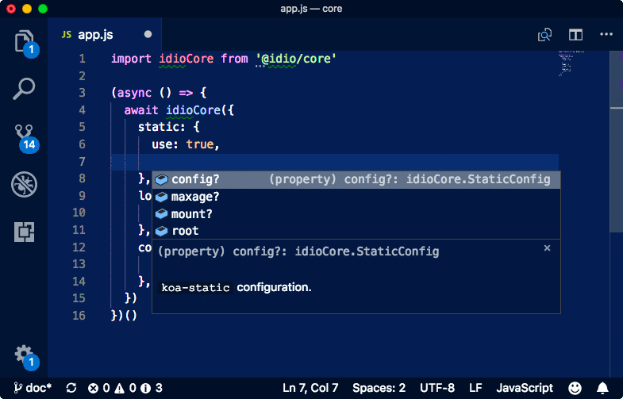

# @idio/idio

[](https://www.npmjs.com/package/@idio/idio)

<a href="https://github.com/idio/core"></a>

`@idio/idio` is a Koa's fork called Goa web server compiled with Closure Compiler so that its source code is optimised and contains only 1 external dependency (`mime-db`). Idio adds essential middleware to Goa, and includes the router.

<p align="center">
  <a href="https://www.idio.cc"></a>
</p>


```sh
yarn add @idio/idio
```

## Table Of Contents

- [Table Of Contents](#table-of-contents)
- [API](#api)
- [`async idio(middlewareConfig=: !MiddlewareConfig, config=: !Config): !Idio`](#async-idiomiddlewareconfig-middlewareconfigconfig-config-idio)
  * [`MiddlewareConfig`](#type-middlewareconfig)
  * [`Config`](#type-config)
  * [`Idio`](#type-idio)
- [Static](#static)
- [Session](#session)
- [Router Set-up](#router-set-up)
- [Copyright & License](#copyright--license)

<p align="center"><a href="#table-of-contents">
  
</a></p>


## API

The package is available by importing its default function and named components:

```js
import idio, { Keygrip } from '@idio/idio'
```

<p align="center"><a href="#table-of-contents">
  
</a></p>

## <code>async <ins>idio</ins>(</code><sub><br/>&nbsp;&nbsp;`middlewareConfig=: !MiddlewareConfig,`<br/>&nbsp;&nbsp;`config=: !Config,`<br/></sub><code>): <i>!Idio</i></code>
Start the server. Sets the `proxy` property to `true` when the NODE_ENV is equal to _production_.

 - <kbd>middlewareConfig</kbd> <em><code><a href="#type-middlewareconfig" title="Middleware configuration for the `idio` server.">!MiddlewareConfig</a></code></em> (optional): The middleware configuration for the `idio` server.
 - <kbd>config</kbd> <em><code><a href="#type-config" title="Server configuration object.">!Config</a></code></em> (optional): The server configuration object.

The app can be stopped with an async `.destroy` method implemented on it that closes all connections.


There are multiple items for middleware configuration:

__<a name="type-middlewareconfig">`MiddlewareConfig`</a> extends FnMiddlewareConfig__: Middleware configuration for the `idio` server.


|   Name   |                                                                                  Type                                                                                   |       Description       |
| -------- | ----------------------------------------------------------------------------------------------------------------------------------------------------------------------- | ----------------------- |
| static   | <em><a href="https://github.com/idiocc/idio/wiki/Static#type-staticoptions" title="The top-level options when setting up the static middleware.">StaticOptions</a></em> | `koa-static` options.   |
| compress | <em>[CompressOptions](#type-compressoptions)</em>                                                                                                                       | `koa-compress` options. |
| session  | <em>[SessionOptions](#type-sessionoptions)</em>                                                                                                                         | `koa-session` options.  |
| cors     | <em>[CorsOptions](#type-corsoptions)</em>                                                                                                                               | `koa-cors` options.     |

The types for starting the server include the address, port and router configuration.

__<a name="type-config">`Config`</a>__: Server configuration object.


|  Name  |                                                                   Type                                                                    |              Description               |  Default  |
| ------ | ----------------------------------------------------------------------------------------------------------------------------------------- | -------------------------------------- | --------- |
| port   | <em>number</em>                                                                                                                           | The port on which to start the server. | `5000`    |
| host   | <em>string</em>                                                                                                                           | The host on which to listen.           | `0.0.0.0` |
| router | <em><a href="https://github.com/idiocc/goa-router/wiki/Home#type-routerconfig" title="Config for the router.">!_goa.RouterConfig</a></em> | The configuration for the router.      | -         |

After the app is started, it can be accessed from the return type.

__<a name="type-idio">`Idio`</a>__: The return type of the idio.


|      Name       |                                                                                                                        Type                                                                                                                         |                                                    Description                                                    |
| --------------- | --------------------------------------------------------------------------------------------------------------------------------------------------------------------------------------------------------------------------------------------------- | ----------------------------------------------------------------------------------------------------------------- |
| __url*__        | <em>string</em>                                                                                                                                                                                                                                     | The URL on which the server was started, such as `http://localhost:5000`.                                         |
| __server*__     | <em><a href="https://nodejs.org/api/http.html#http_class_http_server" title="An HTTP server that extends net.Server to handle network requests.">!http.Server</a></em>          | The server instance.                                                                                              |
| __app*__        | <em><a href="https://github.com/idiocc/goa/wiki/Application#type-application" title="The application interface.">!_goa.Application</a></em>                                                                                                         | The Goa application instance.                                                                                     |
| __middleware*__ | <em>!Object&lt;string, <a href="https://github.com/idiocc/goa/wiki/Application#middlewarectx-contextnext-function-promisevoid" title="The function to handle requests which can be installed with the `.use` method.">!_goa.Middleware</a>&gt;</em> | An object with configured middleware functions, which can be installed manually using `app.use`, or `router.use`. |
| __router*__     | <em><a href="https://github.com/idiocc/goa-router/wiki/Home#type-router" title="Router For Goa Apps.">!_goa.Router</a></em>                                                                                                                         | The router instance.                                                                                              |

The example below starts a simple server with session and custom middleware, which is installed (used) automatically because it's defined as a function.

<table>
<tr><th><a href="example/index.js">Source</a></th><th>Output</th>
</tr><tr>
<td>

```js
const { url, app } = await idio({
  // Idio's bundled middleware.
  session: {
    use: true,
    keys: new Keygrip(['hello', 'world']),
    config: {
      prefix: 'example-',
    },
  },

  // Any middleware function to be installed.
  async middleware(ctx, next) {
    ctx.body = 'hello world'
    await next()
  },
})
```
</td>
<td>

```
http://localhost:5000
hello world
```
</td></tr>
</table>

<p align="center"><a href="#table-of-contents">
  
</a></p>

## Static

> 
> <kbd>🗂 <a href="../../wiki/Static">Explore Static Middleware Configuration</a></kbd>
Used to serve static files, such as stylesheets, images, videos, html and everything else. Will perform mime-type lookup to serve the correct content-type in the returned header.

<table>
<tr><th><a href="example/static.js">Static</a> <a href="example/static2.js">source</a></th><th>The Output</th></tr>
<tr><td>

```js
const { url, app } = await idio({
  static: {
    root: 'example', use: true,
  },
```

```js
// or multiple locations
  static: [{
    root: ['example'], use: true,
  }, {
    root: ['d'], use: true,
  }],
})
```
</td>
<td>

```css
/** http://localhost:53685/app.css */ 

body {
  font-size: larger;
}
```


```svg
<!-- http://localhost:5000/em.svg --> 

<xml></xml>
```
</td></tr>

<tr>
<td colspan="2">

<details>
<summary>Show Response Headers</summary>

```http
Content-Length: 29
Last-Modified: Thu, 18 Jul 2019 14:34:31 GMT
Cache-Control: max-age=0
Content-Type: text/css; charset=utf-8
Date: Fri, 20 Dec 2019 07:04:57 GMT
Connection: close
```


```http
Content-Length: 11
Last-Modified: Thu, 18 Jul 2019 14:47:20 GMT
Cache-Control: max-age=0
Content-Type: image/svg+xml
Date: Fri, 20 Dec 2019 07:05:38 GMT
Connection: close
```
</details>
</td>
</tr>
</table>


## Session


<kbd>[Read Session Configuration](/doc/session.md)</kbd>

Allows to store data in the `.session` property of the context. The session is serialised and placed in cookies. When the request contains the cookie, the session will be restored and validated (if signed) against the key.

<table>
<tr><th><a href="example/session.js">Session source</a></th><th>The Output</th></tr>
<tr><td>

```js
const { url, app } = await idio({
  session: { use: true, keys:
    ['hello', 'world'], config: {
    signed: false,
  } },
  async middleware(ctx, next) {
    if (ctx.session.user)
      ctx.body = 'welcome back '
        + ctx.session.user
    else {
      ctx.session.user = 'u'
        +( Math.random() * 1000).toFixed(1)
      ctx.body = 'hello new user'
    }
    await next()
  },
})
```
</td>
<td>

```
http://localhost:5000 

/ hello new user
/ welcome back u190.1
```
</td>
</tr>
</table>

<p align="center"><a href="#table-of-contents">
  
</a></p>

## Router Set-up

After the _Application_ and _Router_ instances are obtained after starting the server as the `app` and `router` properties of the <a href="1-API/index.md#type-idio" title="The return type of the idio.">returned object</a>, the router can be configured to respond to custom paths. This can be done by assigning configured middleware from the map and standalone middleware, and calling the `use` method on the _Application_ instance.

```js
import { collect } from 'catchment'
import idio from '@idio/core'


const Server = async () => {
  const path = '/test'
  const {
    url, router, app, middleware: { pre, post, bodyparser },
  } = await idio({
    // 1. Configure middlewares via middlewareConstructor without installing them.
    pre: {
      middlewareConstructor() {
        return async function(ctx, next) {
          console.log('  <-- %s %s',
            ctx.request.method,
            ctx.request.path,
          )
          await next()
        }
      },
    },
    post: {
      middlewareConstructor() {
        return async function(ctx, next) {
          console.log('  --> %s %s %s',
            ctx.request.method,
            ctx.request.path,
            ctx.response.status,
          )
          await next()
        }
      },
    },
    bodyparser: {
      middlewareConstructor() {
        return async (ctx, next) => {
          let body = await collect(ctx.req)
          if (ctx.is('application/json')) {
            body = JSON.parse(body)
          }
          ctx.request.body = body
          await next()
        }
      },
    },
  }, { port: 5003 })

  // 2. Setup router with the bodyparser and path-specific middleware.
  router.post(path,
    pre,
    bodyparser,
    async (ctx, next) => {
      ctx.body = {
        ok: true,
        request: ctx.request.body,
      }
      await next()
    },
    post,
  )
  app.use(router.routes())
  return `${url}${path}`
}
```
```
Page available at: http://localhost:5003/test
  <-- POST /test
  --> POST /test 200
```

<p align="center"><a href="#table-of-contents">
  
</a></p>

## Copyright & License

GNU Affero General Public License v3.0

All original work on middleware and Koa are under MIT license.

<idio-footer>

<p align="center"><a href="#table-of-contents">
  
</a></p>